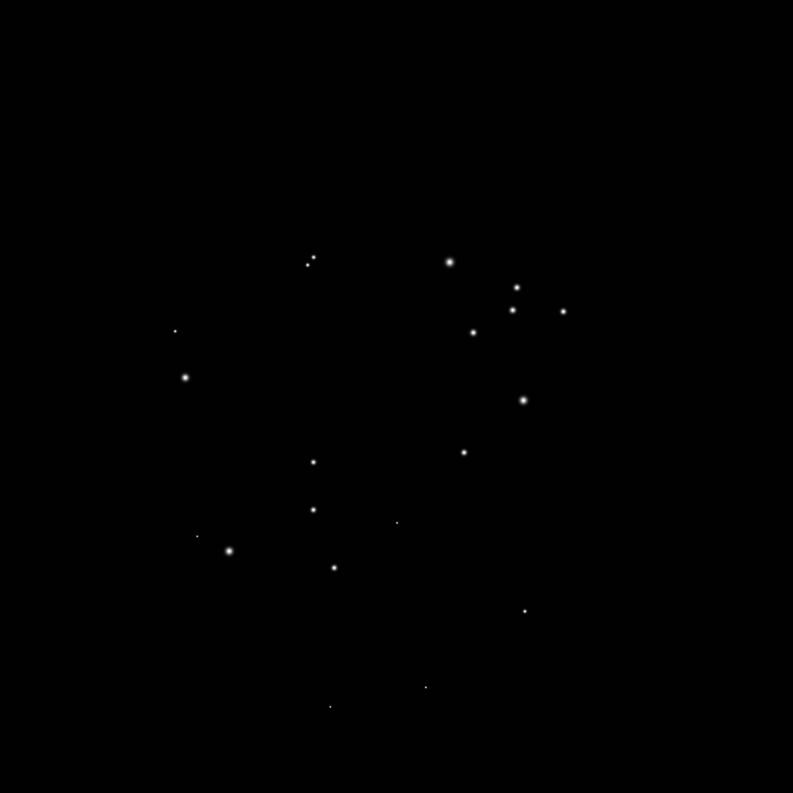
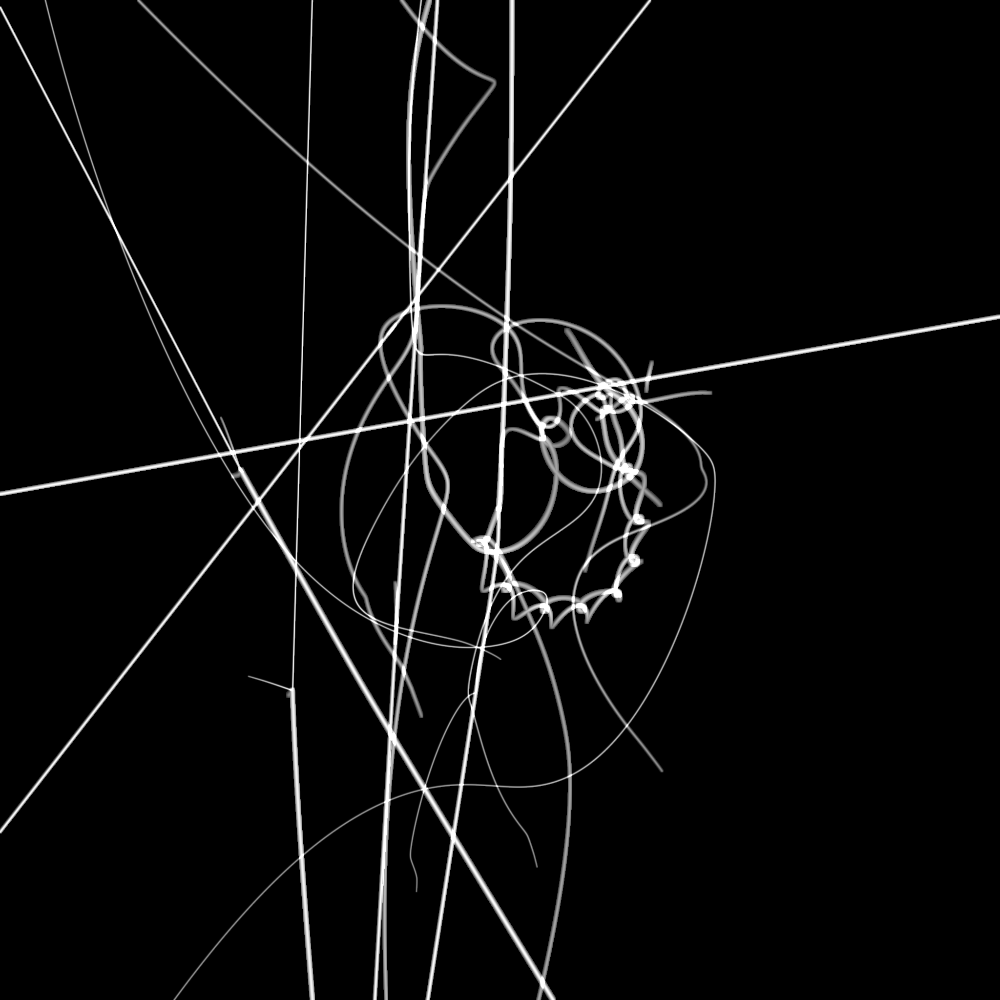

# Gravitational Painting: N-Body Simulation Visualization

Generate artistic visualizations of gravitational N-body dynamics using dimensionless physics simulations.

## Example

<p align="center">
  
  
  <br>
  <em>20-body system: Initial configuration (left) and trajectory evolution (right)</em>
</p>

## Overview

This project creates paired visualizations of gravitational systems:
1. **Initial state**: Point configuration showing body positions and masses
2. **Gravitational painting**: Trajectory evolution where brightness reflects velocity magnitude

The system uses **dimensionless units** (G=1, M=1) for scale-invariant physics, making all simulations directly comparable.

## Architecture

The workflow is separated into two independent stages:

```
generate_random_system.py → simulations/*.npz → painting.py → paintings/*.png
```

### 1. Simulation Generation (`generate_random_system.py`)

Generates random N-body systems and simulates their evolution:
- **Input**: N (number of bodies), simulation time, random seed
- **Physics**: 4th-order Runge-Kutta integration, dimensionless units
- **Output**: Saved to `simulations/system_n{N}_seed{seed}.npz`

**Usage:**
```bash
# Generate 5-body system, simulate for 20 time units
python3 generate_random_system.py -n 5 --seed 123 -t 20

# More bodies, longer simulation
python3 generate_random_system.py -n 10 --seed 456 -t 50 --steps 20000
```

### 2. Visualization (`painting.py`)

Creates artistic renderings from saved simulations:
- **Input**: Simulation NPZ files from `simulations/`
- **Rendering**: Spatial resampling with velocity-based intensity
- **Output**: Paired PNG images in `paintings/`

**Usage:**
```bash
# Render single simulation
python3 painting.py simulations/system_n5_seed123.npz

# Render all simulations in simulations/
python3 painting.py

# Custom resolution
python3 painting.py simulations/system_n5_seed123.npz -r 4096
```

## Physics & Visualization

### Initial Conditions

- **Mass distribution**: Uniform in [0,1], normalized to Σm = 1
- **Positions**: Uniform in unit disk
- **Velocities**: Zero (cold start / gravitational collapse)

### Rendering Algorithm

**Spatial Resampling:**
- Trajectories resampled with uniform spacing (0.001 world units)
- Ensures brightness ∝ velocity, not timestep density
- Fast segments → many samples → bright
- Slow segments → few samples → dim

**Mappings:**
- **Mass → Thickness**: `r = 1 + 2Nm` pixels (linear)
- **Velocity → Intensity**: `I = 1/(1 + e^(-v))` (sigmoid)

**Blending:**
- Within trajectory: maximum (no accumulation)
- Between trajectories: additive, capped at 1.0

## File Structure

```
stellar-system/
├── generate_random_system.py  # Simulation generation
├── painting.py                # Visualization rendering
├── gravitational_system.py    # N-body physics engine
├── integrators.py             # RK4 integrator
├── simulations/               # Saved simulation data (.npz)
├── paintings/                 # Output visualizations (.png)
└── article/                   # LaTeX documentation
    └── main.tex
```

## Output Files

**Simulations** (`simulations/`):
- `system_n{N}_seed{seed}.npz`: Contains positions, velocities, masses, full trajectory history

**Paintings** (`paintings/`):
- `system_n{N}_seed{seed}_points.png`: Initial configuration (white dots on black)
- `system_n{N}_seed{seed}_painting.png`: Trajectory evolution (velocity-mapped intensity)

## Parameters

### Simulation (`generate_random_system.py`)
- `-n, --bodies`: Number of bodies (default: 5)
- `-t, --time`: Simulation time in dynamical units (default: 20.0)
- `--steps`: Integration steps (default: 10000)
- `--seed`: Random seed for reproducibility

### Visualization (`painting.py`)
- `-r, --resolution`: Image resolution (default: 2048)
- Automatically processes N and seed from simulation filename

## Examples

```bash
# Generate multiple systems for dataset
for seed in {1..100}; do
    python3 generate_random_system.py -n 5 --seed $seed -t 20
done

# Render all at once
python3 painting.py

# High-resolution rendering
python3 painting.py -r 4096
```

## Technical Details

- **Dimensionless units**: G=1, total mass M=1, characteristic length ~1
- **Dynamical time scale**: t_dyn ~ √(r³/GM) ~ 1
- **Integration**: 4th-order Runge-Kutta (RK4)
- **Default simulation time**: 20 dynamical times (sufficient for interesting dynamics)
- **Image format**: Grayscale PNG, 8-bit depth

## Dependencies

- NumPy
- Pillow (PIL)

Install with:
```bash
pip install numpy pillow
```

## Citation

If you use this code, please reference:
```
Gravitational Painting: N-Body Simulations in Dimensionless Units
[See article/main.tex for detailed methodology]
```
